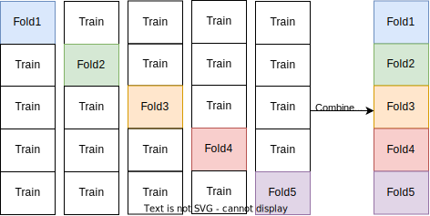

title: Introduction to scikit-learn: Machine Learning in Python
use_katex: True
class: title-slide

# Introduction to scikit-learn: Machine Learning in Python


.larger[Thomas J. Fan]<br>
@thomasjpfan<br>
<a href="https://www.github.com/thomasjpfan" target="_blank"><span class="fa-brands fa-github"></span></a>
<a href="https://www.linkedin.com/in/thomasjpfan" target="_blank"><span class="fa-brands fa-linkedin"></span></a>
<a href="https://www.twitter.com/thomasjpfan" target="_blank"><span class="fa-brands fa-twitter"></span></a>
<a class="this-talk-link", href="https://github.com/thomasjpfan/ml-workshop-intro-v3" target="_blank">
This workshop on Github: github.com/thomasjpfan/ml-workshop-intro-v3</a>

---

# About me

- Senior ML Engineer @ Union.ai

.center[

]

- Maintainer

.center[

]

---

name: table-of-contents
class: title-slide, left

# Table of Contents

.g[
.g-6[
1. [Supervised Learning](#supervised)
1. [Preprocessing](#preprocessing)
1. [Pipelines](#pipelines)
1. [Categorical Data & Pandas Input](#categorical-data)
]
.g-6.g-center[

]
]

---

class: chapter-slide

# Brief Overview of Machine Learning

.footnote-back[
[Back to Table of Contents](#table-of-contents)
]

---

class: middle

# Traditional programming

## Prediction


---

class: middle

# Machine Learning

## Training


## Prediction


---

class: middle

# Types of Machine Learning

- Unsupervised Learning

- Reinforcement Learning

- Supervised Learning

---

# Unsupervised Learning

.center[

]

.footnote[
[Link to Source](https://scikit-learn.org/dev/auto_examples/cluster/plot_cluster_comparison.html#sphx-glr-auto-examples-cluster-plot-cluster-comparison-py)
]

---

# Reinforcement Learning


---

# Statistics vs Machine learning

.g[
.g-6[
## Statistics
- Inference Focused
]
.g-6[
# Supervised Machine Learning
- Prediction Focused

]
]

---

name: supervised
class: chapter-slide

# 1. Supervised Learning

.footnote-back[
[Back to Table of Contents](#table-of-contents)
]

---

# Supervised Learning

$$
(x_i, y_i) \propto p(x, y) \text{ i.i.d}
$$
- $p$ is an unknown joint distribution
- i.i.d means independent identically distributed

$$x_i \in \mathbb{R}^p$$
$$y_i \in \mathbb{R}$$

## Goal during training
$$f(x_i) \approx y_i$$

---

# Generalization

## Goal during training
$$f(x_i) \approx y_i$$

## Generalization
$$f(x) \approx y$$

For *non-training data*: $x$

---

class: middle

# Classification and Regression

.g[
.g-6[
## Classification
- target $y$ is discrete
- Does the patient have cancer?
]
.g-6[
## Regression
- target $y$ is continuous
- What is the price of the home?
]
]

---

# Data Representation


---

# Loading Datasets

## Random datasets
```py
from sklearn.datasets import make_classification
from sklearn.datasets import make_regression
```

## Sample datasets
```py
from sklearn.datasets import load_breast_cancer
from sklearn.datasets import load_diabetes
from sklearn.datasets import load_digits
from sklearn.datasets import load_iris
from sklearn.datasets import load_wine
```

## OpenML

```py
from sklearn.datasets import fetch_openml
```

---

# Splitting Training and Test Data


---


# Supervised ML Workflow


---

# Supervised ML Workflow


---

class: chapter-slide

# Notebook 📓!
## notebooks/01-supervised-learning.ipynb

---

name: preprocessing
class: chapter-slide

# 2. Preprocessing

.footnote-back[
[Back to Table of Contents](#table-of-contents)
]

---

# Housing Dataset


---

# Feature Ranges


---

# KNN Scaling


---

# KNN Scaling Decision Boundary


---

# Notebook 📕!
## notebooks/02-preprocessing.ipynb

---

# Scikit-Learn API


.center[
## `estimator.fit(X, [y])`
]

.g[
.g-6[
## `estimator.predict`
- Classification
- Regression
- Clustering
]
.g-6[
## `estimator.transform`
- Preprocessing
- Dimensionality reduction
- Feature selection
- Feature extraction
]
]

---

# Transform outputs NumPy arrays by default

```python
from sklearn.preprocessing import StandardScaler

scaler = StandardScaler()
scaler.fit_transform(X_train)
```


---

# Configured for Pandas Output!

```python
*scaler.set_output(transform="pandas")
scaler.fit_transform(X_train)
```


---

class: chapter-slide

# Notebook 📕!
## notebooks/02-preprocessing.ipynb

---

# Imputers in scikit-learn

## Impute module

```py
from sklearn.impute import SimpleImputer
from sklearn.impute import KNNImputer

# `add_indicator=True` to add missing indicator
imputer = SimpleImputer(add_indicator=True)

from sklearn.experimental import enable_iterative_imputer
from sklearn.impute import IterativeImputer
```

---

# Comparing the Different methods


---

class: chapter-slide

# Notebook 📕!
## notebooks/02-preprocessing.ipynb

---

name: pipelines
class: chapter-slide

# 3. Pipelines

.footnote-back[
[Back to Table of Contents](#table-of-contents)
]

---

# Why Pipelines?

- Preprocessing must be fitted on training data only!

## Bad
```py
selector = SequentialFeatureSelector()
X_train_selected = selector.fit_transform(X_train)
X_test_selected = selector.fit_transform(X_test)
```

## Good
```py
selector = SequentialFeatureSelector()
X_train_selected = selector.fit_transform(X_train)
X_test_selected = selector.transform(X_test)
```

---

# Pipeline Example

## Before

```py
selector = SequentialFeatureSelector().fit(X_train)
X_train_selected = selector.transform(X_train)

est = RandomFores().fit(X_train_selected, y_train)

# Evaluate on test data
X_test_selected = selected.transform(X_test)
est.score(X_test_selected, y_test)
```

## After

```py
*from sklearn.pipeline import make_pipeline

pipe = make_pipeline(SequentialFeatureSelector(), Ridge())

pipe.fit(X_train, y_train)
pipe.score(X_test, y_test)
```

---

# Pipeline Overview


---

class: chapter-slide

# Notebook 📕!
## notebooks/03-pipelines.ipynb

---

name: categorical-data
class: chapter-slide

# 4. Categorical Data & Pandas Input

.footnote-back[
[Back to Table of Contents](#table-of-contents)
]

---

# Categorical Data

## Examples of categories:

- `['Manhattan', 'Queens', 'Brooklyn', 'Bronx']`
- `['dog', 'cat', 'mouse']`

## Scikit-learn Encoders

`OrdinalEncoder`: Encodes categories into an integer
```py
from sklearn.preprocessing import OrdinalEncoder
```

`OneHotEncoder`: Encodes categories using a one-hot encoding scheme
```py
from sklearn.preprocessing import OneHotEncoder
```

---

# `TargetEncoder`
## Encodes categories using target statistics

```python
from sklearn.preprocessing import TargetEncoder

target_encoder = TargetEncoder()
target_encoder.fit_transform(X, y)
```



---

class: chapter-slide

# Notebook 📕!
## notebooks/04-categorical-data.ipynb

---

# Heterogenous data

## Example: Titanic Dataset

<table border="1" class="dataframe">
  <thead>
    <tr style="text-align: right;">
      <th></th>
      <th>pclass</th>
      <th>sex</th>
      <th>age</th>
      <th>sibsp</th>
      <th>parch</th>
      <th>fare</th>
      <th>embarked</th>
      <th>body</th>
    </tr>
  </thead>
  <tbody>
    <tr>
      <th>0</th>
      <td>1.0</td>
      <td>female</td>
      <td>29.0000</td>
      <td>0.0</td>
      <td>0.0</td>
      <td>211.3375</td>
      <td>S</td>
      <td>NaN</td>
    </tr>
    <tr>
      <th>1</th>
      <td>1.0</td>
      <td>male</td>
      <td>0.9167</td>
      <td>1.0</td>
      <td>2.0</td>
      <td>151.5500</td>
      <td>S</td>
      <td>NaN</td>
    </tr>
    <tr>
      <th>2</th>
      <td>1.0</td>
      <td>female</td>
      <td>2.0000</td>
      <td>1.0</td>
      <td>2.0</td>
      <td>151.5500</td>
      <td>S</td>
      <td>NaN</td>
    </tr>
    <tr>
      <th>3</th>
      <td>1.0</td>
      <td>male</td>
      <td>30.0000</td>
      <td>1.0</td>
      <td>2.0</td>
      <td>151.5500</td>
      <td>S</td>
      <td>135.0</td>
    </tr>
    <tr>
      <th>4</th>
      <td>1.0</td>
      <td>female</td>
      <td>25.0000</td>
      <td>1.0</td>
      <td>2.0</td>
      <td>151.5500</td>
      <td>S</td>
      <td>NaN</td>
    </tr>
  </tbody>
</table>

---

# scikit-learn's ColumnTransformer


---

# notebook 📕!
## notebooks/04-categorical-data.ipynb

---

# Histogram-based Gradient Boosting Classification Trees 🌲

.g[
.g-4[

]
.g-4[

]
.g-4[

]
]

---

# Histogram-based Gradient Boosting Classification Trees 🌲

```python
from sklearn.ensemble import HistGradientBoostingRegressor
from sklearn.ensemble import HistGradientBoostingClassifier
```

.g.g-center[
.g-6[

]
.g-6[

]
]


---

class: chapter-slide

# Notebook 📕!
## notebooks/04-categorical-data.ipynb

---

class: title-slide, left


.g.g-middle[
.g-7[
1. [Supervised Learning](#supervised)
1. [Preprocessing](#preprocessing)
1. [Pipelines](#pipelines)
1. [Categorical Data & Pandas Input](#categorical-data)
]
.g-5.center[
.larger[Thomas J. Fan]<br>
@thomasjpfan<br>
<a href="https://www.github.com/thomasjpfan" target="_blank"><span class="fa-brands fa-github"></span></a>
<a href="https://www.linkedin.com/in/thomasjpfan" target="_blank"><span class="fa-brands fa-linkedin"></span></a>
<a href="https://www.twitter.com/thomasjpfan" target="_blank"><span class="fa-brands fa-twitter"></span></a>
]
]

<br>

### Today's Material - [github.com/thomasjpfan/ml-workshop-intro-v3](github.com/thomasjpfan/ml-workshop-intro-v3)
### Tomorrow - *Flyte: A Production-Ready Open Source AI Platform @ 12:10 PM*
